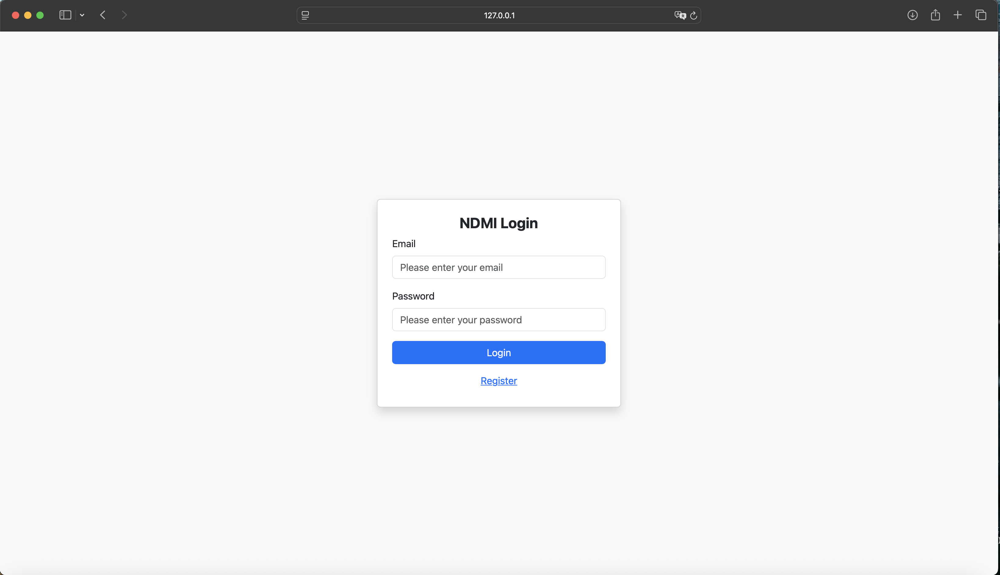
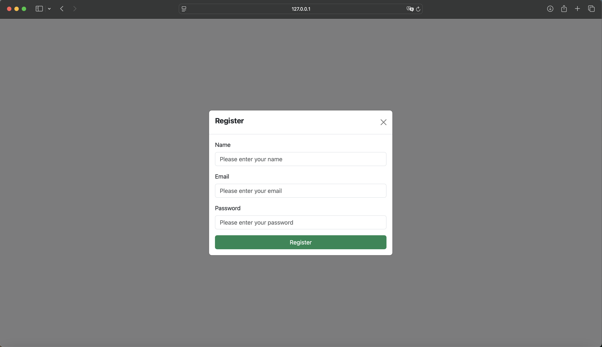
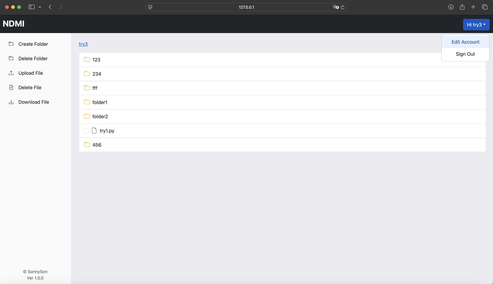
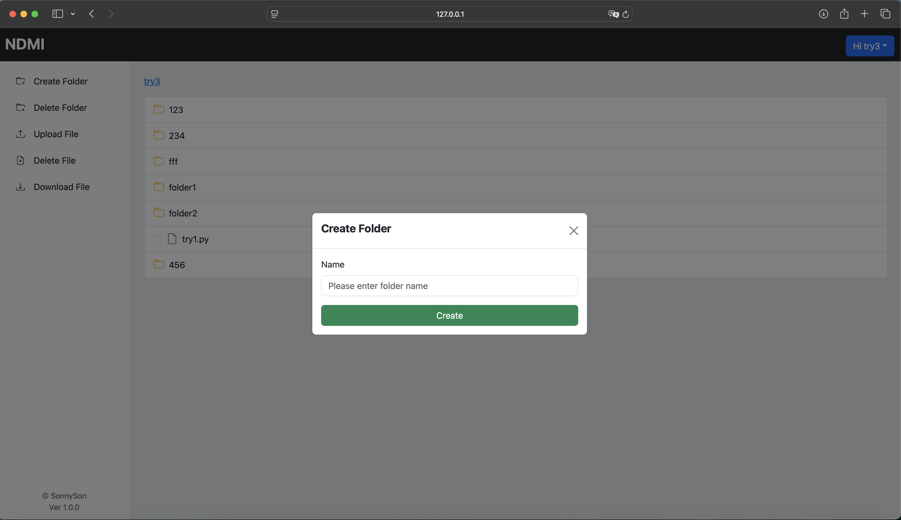
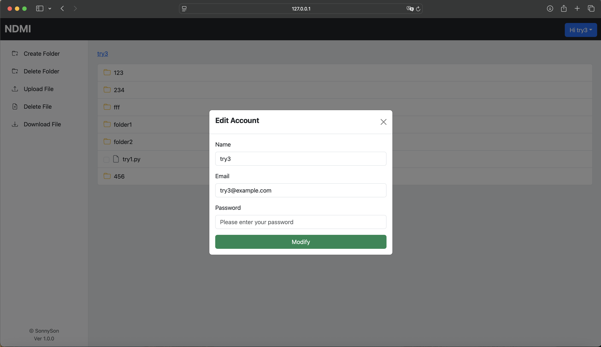
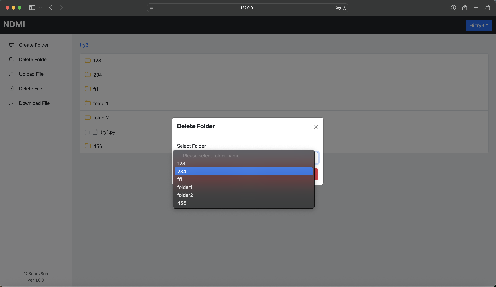
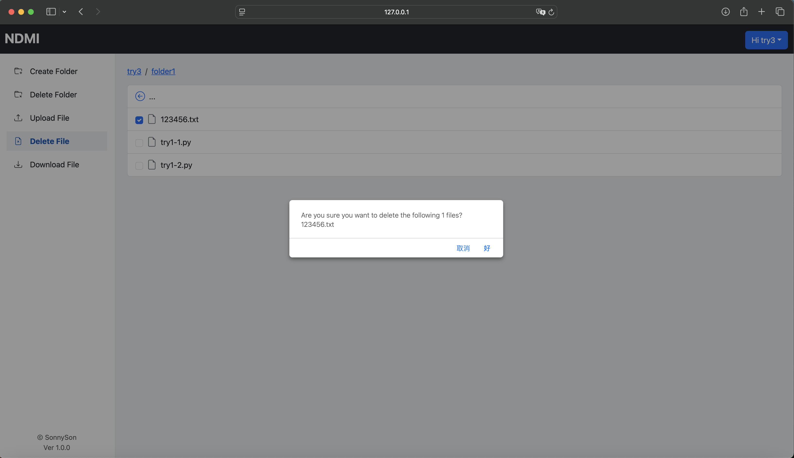

# Network Drive Management System

打造一個簡潔直觀的雲端硬碟管理介面，讓使用者能輕鬆上傳、下載、管理與瀏覽雲端檔案。

## 壹、基本說明
**一、目標：**
本系統為一個可自架的輕量級雲端硬碟管理平台，支援檔案上傳、下載、刪除與資料夾結構維護，適用於個人雲端備份、教學資源分享或企業內部文件整合。前端以Vue.js构建互動式UI，後端則採用Node.js架設RESTful API，搭配MongoDB資料庫，實現即時、彈性的檔案操作流程。
<br>

**二、開發環境：**
以下是開發前後平台所採用的環境：
* 虛擬機：Docker
* 程式語言：JavaScript
* JavaScript執行環境：Node.js
* Node.js資源管理工具：npm
* JavaScript前端框架：Vue.js
* Vue CLI：Vue.js開發環境
* 資料庫：MongoDB
* 程式編輯器：Visual Studio Code
* 測試瀏覽器：Safari（Google Chrome似乎會阻擋報錯，目前未修正）

**三、使用相依套件：**
1. 以下是後端平台所使用的Node.js套件：
* express（Web應用程式架構）
* cors (跨來源資源共用)
* dotenv（將敏感變數放入環境變數中）
* bcrypt（密碼雜湊函式）
* jsonwebtoken（JSON Web Token）
* multer（處理文件上傳到伺服器）

2. 以下是前端平台所使用的Vue.js套件：
* vue-router（前端路由管理器）npm install vue-router@4
* axios（API請求）
* jwt-decode（JWT解碼器）
* bootstrap（CSS框架）

**四、對於RESTful API請求：** 
以下是此後端平台提供的RESTful API端點，包含對應的HTML方法、路徑及參數說明，如下所示：
* `POST` /users：新增用戶(請求內容有name、email、password)
* `POST` /login：用戶登入(請求內容有email、password)
* `PUT` /users/:id：更新用戶(請求內容有name、email、password)
* `PUT` /files?path=<路徑>：取得雲端硬碟檔案清單
* `POST` /create-folder：新增資料夾(請求內容有path)
* `DELETE` /delete-folder?path=<路徑>：刪除資料夾
* `POST` /upload-file：上傳檔案(請求內容有上傳檔案跟path，兩者請求內容是不一樣的)
* `GET` /download-file?path=<路徑>：下載檔案
* `DELETE` /delete-file?path=<路徑>：刪除檔案
> [!Warning]
> 請特別注意，除了新增用戶與用戶登入外，其餘使用RESTful API都需要傳入jwt進行驗證。

**五、檔案說明：** 
此專案檔案主要可分為兩個資料夾：Backend和Frontend。其中，Backend資料夾為後端平台的主要程式碼，Frontend資料夾則為前端平台的部分主要程式碼。接下來將對各資料夾中的檔案內容進行詳細說明。
1. Backend
* server.js：為RESTful API的主要程式碼。

2. Frontend(請以Vue CLI創建專案)
* index.html：瀏覽器一開始加載的HTML檔案。
* main.js：應用程式的進入點。
* app.vue：根元件。
* UserLogin.vue：登入頁面。
* MainPage.vue：雲端硬碟管理介面。

## 貳、操作說明
**一、安裝程式方式：** 
從GitHub下載該檔案，由於前後端採用分離的系統架構，其安裝方式亦有所差異，具體操作如下所示：
1. Backend
* 安裝Node、NPM跟MongoDB
* 創建一個資料夾，建立專案
```bash
mkdir <資料夾名稱>
cd <資料夾名稱>
npm init -y
```
* 安裝套件
```bash
npm install express
npm install cors
npm install dotenv
npm install bcrypt
npm install jsonwebtoken
npm install multer
npm install nodemon
```
* 複製後端程式server.js，至專案資料夾
* 執行伺服器
```bash
nodemon server.js
```
2. Frontend
* 安裝Node、NPM跟Vue CLI
* 創建一個資料夾，建立專案
```bash
mkdir <資料夾名稱>
cd <資料夾名稱>
vue create my-vue3-project
```
* 安裝套件
```bash
npm install axios
npm install jwt-decode
```
* 複製前端程式到對應資料夾，index.html取代public中的index.html、main.js跟App.vue取代src中的main.js跟App.vue、UserLogin.vue跟MainPage.vue放置src/views中
* 執行伺服器
```bash
npm run serve
```
**二、運行結果：**
當前後端架構完成建置後，您只需在瀏覽器中輸入127.0.0.1:8080/login以開啟應用程式。以下展示的是系統實際呈現的網頁畫面。

1.登入畫面
<br>
  <div align="center">
  	
  </div>
<br>
2.新增用戶畫面
<br>
  <div align="center">
  	
  </div>
<br>
3.管理介面畫面
<br>
  <div align="center">
  	
  </div>
<br>
4.編輯用戶資訊
<br>
  <div align="center">
  	
  </div>
<br>
5.新增資料夾
<br>
  <div align="center">
  	
  </div>
<br>
6.刪除資料夾
<br>
  <div align="center">
  	
  </div>
<br>
6.進入資料夾、上傳檔案、刪除資料夾與檔案，能直接能透過點選方式進行操作
<br>
  <div align="center">
  	
  </div>
<br>

## 參、建議
**反思：** 若能在現有功能基礎上，進一步加入滑鼠拖曳上傳的功能，讓使用者可直接將檔案拖入管理介面完成上傳，將能顯著提升本專案的實用性與整體使用體驗。然而，專案仍存在些許遺憾：由於開發階段未考慮到中文檔案名稱的情境，導致目前在處理中文檔名時會出現亂碼問題；此外，由於主要以Safari瀏覽器進行測試與開發，Google Chrome在部分情況下可能會因安全性限制而阻擋請求並產生錯誤，目前尚未進行修正。
